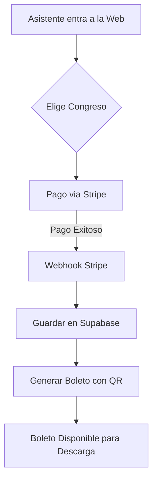
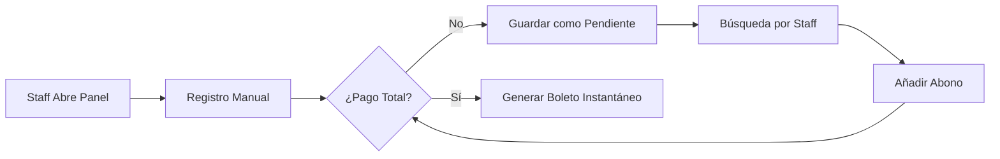
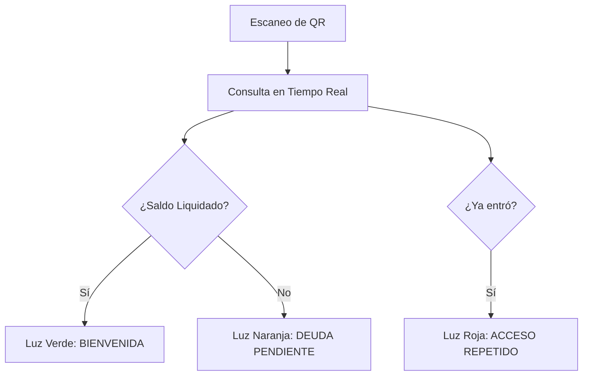

# 🌿 Sistema de Registro y Control: Mujeres 2026

Este proyecto es la plataforma centralizada para la gestión de inscripciones, cobranza y acceso a la **Conferencia de Mujeres 2026**. Ha sido diseñado bajo un estándar de ingeniería de alto nivel, priorizando la velocidad operativa, la seguridad financiera y la facilidad de uso para el staff voluntario.

## 🏛️ Arquitectura del Sistema: "Fríamente Calculado"

El ecosistema se basa en tecnologías de vanguardia que garantizan un **tiempo de actividad del 99.9%** y una respuesta instantánea incluso con alto tráfico de usuarios.

- **Frontend (Astro v5)**: Implementa *Server-Side Rendering* (SSR) para procesar datos dinámicos en milisegundos.
- **Backend (Supabase)**: Motor de base de datos PostgreSQL con capacidades "Real-time" para sincronizar la cobranza con la entrada.
- **Pasarela de Pagos (Stripe)**: Manejo de pagos digitales (Tarjetas, OXXO) con seguridad de grado bancario.
- **Motor Gráfico (Canvas)**: Generación automática de boletos PDF/JPG personalizados con códigos QR únicos.

---

## 📈 Flujos de Operación (Diagramas)

### 1. Inscripción y Pago Digital
Este flujo ocurre cuando una asistente se registra a través de la página web oficial.

### 2. Registro Manual y Gestión de Abonos
Diseñado para el "Staff Administrativo" que gestiona pagos físicos en mesas de registro.

### 3. Control de Acceso (Check-in)
Operación en la puerta del evento usando cualquier dispositivo con cámara.

---

## 🛠️ Guía del Administrador (Staff)

### Registro Manual (/admin/registro-manual)
1. **Acceso**: Requiere clave oficial configurada en variables de entorno.
2. **Registro**: Captura de Nombre, WhatsApp, Categoría (Brave/Valiente) y Procedencia.
3. **Cobro**: Permite registrar montos parciales. El sistema calcula automáticamente el adeudo.
4. **Botes**: Solo se liberan cuando el monto total ($130) es cubierto.

### Check-in (/admin/checkin)
1. **Infrarrojo/Cámara**: Compatible con escáneres físicos o la cámara del celular.
2. **Validación**: Muestra instantáneamente el estado de pago del asistente para evitar accesos sin liquidar.

---

## ⚙️ Configuración Técnica

El sistema requiere las siguientes variables de entorno (`.env`):

| Variable | Propósito |
| :--- | :--- |
| `PUBLIC_SUPABASE_URL` | Endpoint de la base de datos |
| `PUBLIC_SITE_URL` | URL base para la generación de enlaces QR |
| `STRIPE_SECRET_KEY` | Conexión con la pasarela de pagos |
| `ADMIN_PASSWORD` | Clave Maestra para el portal Staff |

---

## 🚀 Escalabilidad
El sistema está optimizado para manejar entre **700 y 800 asistentes** distribuidos en dos semanas. Gracias a la arquitectura "Serverless" de Netlify y el procesamiento en la nube de Supabase, el costo de mantenimiento es mínimo y la velocidad es máxima.

> [!IMPORTANT]
> **Mantenimiento**: No se requieren servidores físicos. El sistema escala horizontalmente de forma automática. 🌿✨
